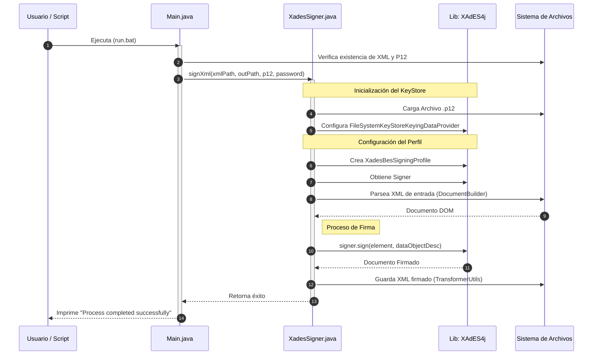
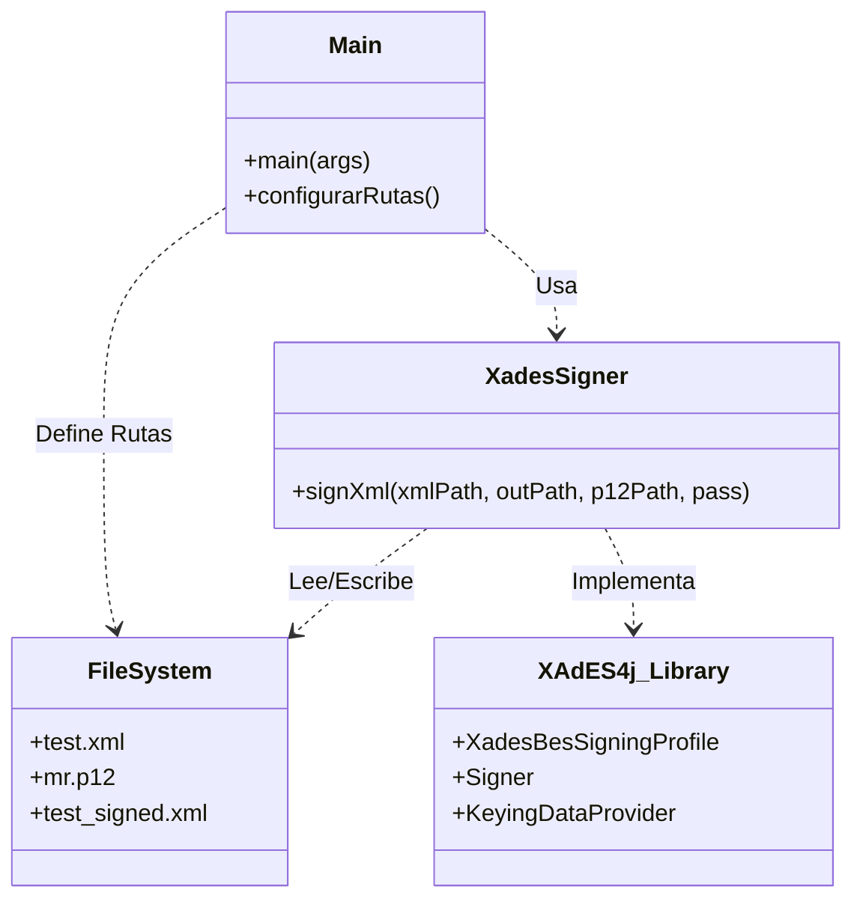

# Diagramas de Funcionamiento - JAVA-xades

Este documento detalla el flujo de funcionamiento del firmador electrónico XAdES-BES.

## 1. Flujo del Proceso (Flowchart)

Este diagrama muestra el flujo de alto nivel desde la ejecución hasta la firma del documento.

```mermaid
graph TD
    Start((Inicio)) --> Init[Inicializar Main]
    Init --> LoadConfig[Cargar Configuración\nRutas: XML, P12, Salida]
    
    subgraph Validación
        LoadConfig --> CheckFiles{¿Existen Archivos?}
        CheckFiles -- No --> ErrorFiles[Error: Archivo no encontrado]
        CheckFiles -- Si --> LoadKey[Cargar Keystore .p12]
    end

    subgraph Firma XAdES
        LoadKey --> InitXades[Inicializar XadesSigner\n(XAdES4j Library)]
        InitXades --> ReadXML[Leer XML de Entrada]
        ReadXML --> ApplySign[Aplicar Firma XAdES-BES]
        ApplySign --> Output[Generar Estructura Firmada]
    end

    Output --> WriteFile[Escribir test_signed.xml]
    WriteFile --> Success((Fin Exitoso))
    
    ErrorFiles --> EndError((Fin con Error))
    LoadKey -- Error Password --> EndError
```

## 2. Diagrama de Secuencia

Detalle técnico de las interacciones entre las clases Java y la librería XAdES4j.



## 3. Estructura de Componentes


